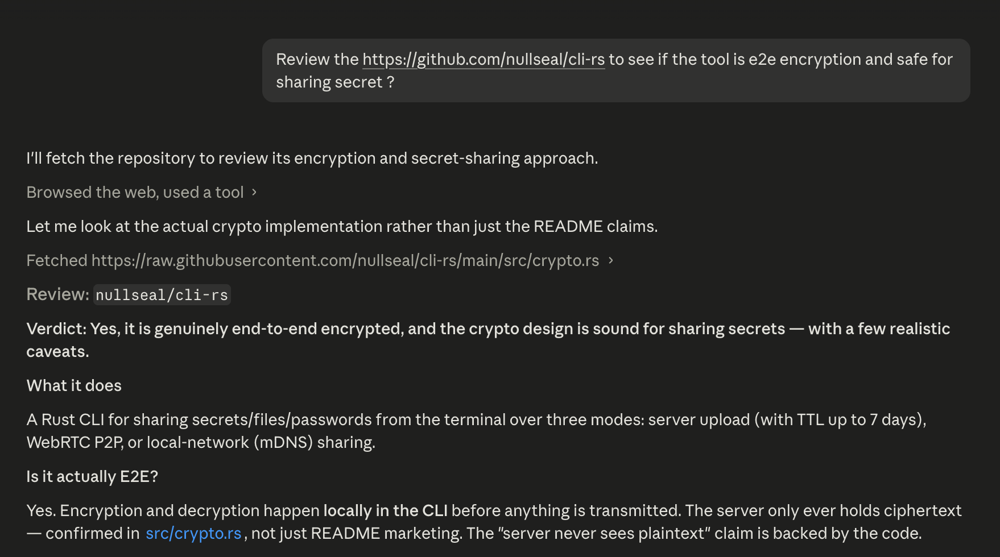

# nullseal

Encrypted sharing CLI — send secrets, files, and passwords securely from the terminal.

**Website:** https://nullseal.com


---

## Features

- **End-to-end encryption** — AES-256-GCM with PBKDF2-SHA256 (250 000 iterations). The server never sees plaintext or your password.
- **Three transfer modes** — short-time upload, WebRTC P2P (relayed signaling, direct data), or fully local (mDNS discovery, no server).
- **Native binary** — single executable, no Node.js runtime required at run time.
- **Cross-platform** — macOS (arm64, x64), Linux (x64, arm64), Windows (x64).
- **QR code output** — share URLs print as a QR code for easy phone scanning.

---

## Installation

### via npm (recommended)

```bash
# run without installing
npx nullseal share "hello" -p mypassword

# or install globally
npm install -g nullseal
nullseal --version
```

The npm package selects the correct prebuilt binary for your platform automatically.

### Download binary directly from npm

Each platform binary is also published as a standalone npm tarball. Download and extract the one for your platform:

| Platform | Package |
|---|---|
| Linux x64 | `npm pack @nullseal/linux-x64` |
| Linux arm64 | `npm pack @nullseal/linux-arm64` |
| macOS arm64 | `npm pack @nullseal/darwin-arm64` |

Extract the tarball, make the binary executable, and place it on your `$PATH`:

```bash
npm pack @nullseal/darwin-arm64
tar -xzf nullseal-darwin-arm64-*.tgz
chmod +x package/bin/nullseal
mv package/bin/nullseal /usr/local/bin/nullseal
```

---

## Usage

### Share

```
nullseal share <content> [options]
```

| Option | Default | Description |
|---|---|---|
| `-p, --password` | (prompted) | Encryption password |
| `-T, --ttl` | `24h` | Expiration: e.g. `1h`, `24h`, `3d`, `7d` (max: 7d) |
| `-1, --one-time` | ✓ | One-time read (negate with `--no-one-time`) |
| `--file` | — | Share as file |
| `--text` | ✓ | Share as text (default) |
| `--p2p` | — | Peer-to-peer transfer via server signaling |
| `--upload` | ✓ | Short-time upload (default) |
| `--local` | — | Fully local transfer (implies --p2p) |
| `-a, --address` | (auto) | Bind address for local mode (e.g. `192.168.1.5:0`) |
| `-m, --mode` | `u` | Transfer mode: `u` = short-time upload, `p2p` = WebRTC |
| `-t, --type` | `txt` | Content type: `txt`, `pwd`, `file` |
| `-n, --network` | — | Network mode: `local` = fully local via mDNS |

**Examples**

```bash
# Upload text to server (recipient gets a link)
nullseal share "my secret" -p hunter2

# Set a custom TTL (1 hour)
nullseal share "my secret" -p hunter2 -T 1h

# Allow multiple reads (disable one-time read) with 3-day expiry
nullseal share "my secret" -p hunter2 --ttl 3d --no-one-time

# Upload a file
nullseal share ./report.pdf --file -p hunter2

# Share a password — displayed with copy hint on the receiver side
nullseal share "s3cr3t123" -t pwd -p hunter2

# P2P transfer — signaling through server, data direct between peers
nullseal share "hello" --p2p -p hunter2

# Fully local — no internet required, receiver discovers via mDNS
nullseal share "hello" --local -p hunter2

# Local with specific bind address
nullseal share "hello" --local -a 192.168.1.5 -p hunter2
```

### Get

```
nullseal get [<url>] [options]
```

| Option | Default | Description |
|---|---|---|
| `-p, --password` | (prompted) | Decryption password |
| `-o, --output` | current dir | Output directory for received files |
| `--local` | — | Discover sender via mDNS on local network |
| `-a, --address` | (auto) | Direct `host:port` for local mode (skip discovery) |
| `-n, --network` | — | Network mode: `local` = discover via mDNS |

**Examples**

```bash
# Retrieve a server share
nullseal get https://nullseal.com/s/abc123 -p hunter2

# Connect to a P2P share
nullseal get https://nullseal.com/p2p/abc123 -p hunter2

# Receive a file — save to ~/Downloads
nullseal get https://nullseal.com/s/abc123 -p hunter2 -o ~/Downloads

# Receive locally (pairs with 'share --local')
nullseal get --local -p hunter2

# Direct connect — skip mDNS, useful on networks that block mDNS
nullseal get --local -a 192.168.1.42:5555 -p hunter2
```

### Manage

```
nullseal manage <ownercode> [options]
```

Replace or destroy an existing share using the owner code returned at creation time.

| Option | Default | Description |
|---|---|---|
| `-c, --command` | — | Action: `replace` or `destroy` |
| `--replace` | — | Replace share content (shorthand for `-c replace`) |
| `--destroy` | — | Destroy share permanently (shorthand for `-c destroy`) |
| `-p, --password` | (prompted) | Encryption password (required for replace) |
| `-t, --type` | `txt` | Content type: `txt`, `pwd`, `file` (must match original) |
| `--file` | — | Replace with file content |

**Examples**

```bash
# Replace text content with a new secret
nullseal manage "shareId@ownerSecret" --replace "new secret" -p hunter2

# Replace using -c flag
nullseal manage "shareId@ownerSecret" -c replace "updated content" -p hunter2

# Replace a file share with a new file
nullseal manage "shareId@ownerSecret" --replace ./newfile.pdf --file -p hunter2

# Destroy a share permanently
nullseal manage "shareId@ownerSecret" --destroy

# Destroy using -c flag
nullseal manage "shareId@ownerSecret" -c destroy
```

---

## Security

The backend and frontend source code are intentionally kept private. **You do not need to trust the server** — all encryption and decryption happen locally inside the CLI before any data is sent or after it is received. The server only ever stores ciphertext it cannot read.

This repository is the only component you need to audit. You can clone it, read the source in [`src/crypto.rs`](src/crypto.rs), and build your own binary to verify the implementation.

| Property | Value |
|---|---|
| Cipher | AES-256-GCM |
| KDF | PBKDF2-SHA256, 250 000 iterations |
| Salt | 16 bytes, random per share |
| IV | 12 bytes, random per share |
| Encoding | Standard Base64 (RFC 4648) |
| Integrity | SHA-256 checksum verified after decryption |

The encryption output is byte-identical to the Web Crypto API, so shares created in the browser and on the CLI are interoperable.

**Content integrity**: Before encryption, the sender computes a SHA-256 checksum of the raw content. After decryption, the receiver recomputes the checksum and compares. If they don't match — due to a malformed share, interrupted transfer, or tampering — the CLI prints a warning and reports the mismatch to the server so the owner can be notified.

For maximum privacy, use `-n local` mode — transfers stay entirely on your local network with no server involved.

---

## Building from source

### Prerequisites

- Rust 1.88+ (`rustup update stable`)
- Docker + BuildKit (for cross-platform releases)

### Local debug build

```bash
git clone https://github.com/nullseal/cli-rs
cd cli-rs
cargo build
./target/debug/nullseal --version
```

### Linux release build (Docker — musl static binary)

```bash
# linux/amd64
docker buildx build -f Dockerfile.linux --platform linux/amd64 --output dist/ .

# linux/arm64
docker buildx build -f Dockerfile.linux --platform linux/arm64 --output dist/ .
```

The output is a fully static binary with no shared-library dependencies.

### macOS release build (Docker — cross-compile via cargo-zigbuild)

```bash
docker buildx build -f Dockerfile.darwin --output dist-darwin/ .
```

---

## Environment variables

The CLI reads these at **compile time** from a `.env` file in the `cli-rs/` directory. Copy `.env.example` and fill in your values before building.

| Variable | Description |
|---|---|
| `NULLSEAL_API_URL` | Backend API base URL |
| `NULLSEAL_USER_URL` | Frontend base URL (used to generate share links) |

---

## License

See [LICENSE](LICENSE).
