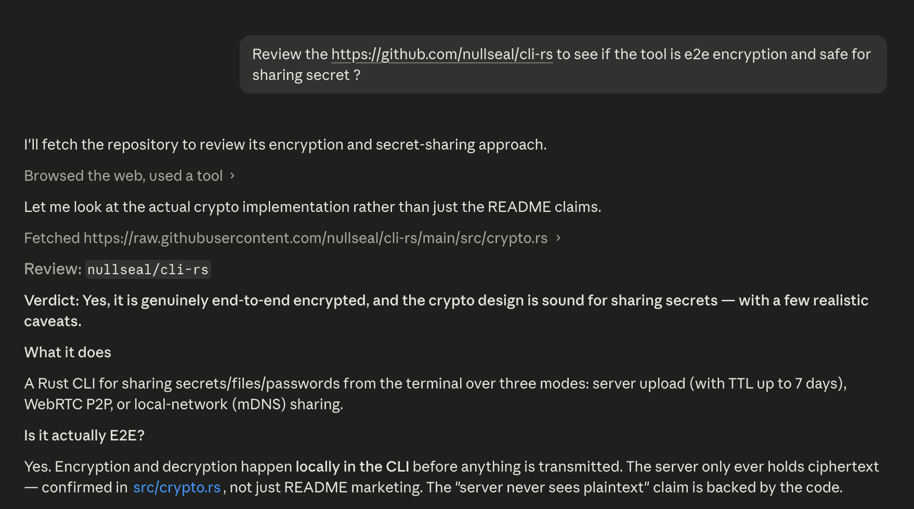

# nullseal

Encrypted sharing CLI — send secrets, files, and folders securely from the terminal.

**Website:** https://nullseal.com


---

## Features

- **End-to-end encryption** — AES-256-GCM with PBKDF2-SHA256 (250 000 iterations). The server never sees plaintext or your password.
- **Three transfer modes** — short-time upload, WebRTC P2P (relayed signaling, direct data), or fully local (mDNS discovery, no server).
- **Folder sharing** — pack a directory into one archive (`--zip`) or transfer its files directly with hash-based change detection (`--sync`).
- **Automatic retry & resume** — P2P transfers retry up to 3 times on ICE/connection failure (backoff 1s/2s/4s). Resumable transfer skips already-delivered chunks using a chunk-index protocol.
- **Connectivity diagnostics** — `nullseal check server` / `nullseal check turn` tell you *why* a transfer can't connect.
- **Native binary** — single executable, no Node.js runtime required at run time.
- **Cross-platform** — macOS (arm64, x64), Linux (x64, arm64), Windows (x64).
- **QR code output** — share URLs print as a QR code for easy phone scanning.

---

## Installation

### via npm (recommended)

```bash
# run without installing
npx nullseal share "hello" -p mypassword

# or install globally
npm install -g nullseal
nullseal --version
```

The npm package selects the correct prebuilt binary for your platform automatically.

### Download binary directly from npm

Each platform binary is also published as a standalone npm tarball. Download and extract the one for your platform:

| Platform | Package |
|---|---|
| Linux x64 | `npm pack @nullseal/linux-x64` |
| Linux arm64 | `npm pack @nullseal/linux-arm64` |
| macOS arm64 | `npm pack @nullseal/darwin-arm64` |
| macOS x64 | `npm pack @nullseal/darwin-x64` |
| Windows x64 | `npm pack @nullseal/win32-x64` |

Extract the tarball, make the binary executable, and place it on your `$PATH`:

```bash
npm pack @nullseal/darwin-arm64
tar -xzf nullseal-darwin-arm64-*.tgz
chmod +x package/bin/nullseal
mv package/bin/nullseal /usr/local/bin/nullseal
```

---

## Usage

```
nullseal share <content> [options]
nullseal get [<url>] [options]
nullseal manage <ownercode> [options]
nullseal check server|turn [options]
```

### Global options

| Option | Description |
|---|---|
| `--pipe` | Machine-friendly: only the result goes to stdout, no logs; failures signal via exit code (conflicts with `--verbose`) |
| `--verbose` | Print the full lifecycle/transport event stream (`· …` lines), including ICE diagnostics |
| `--stdin` | Read share content from stdin instead of the argument (the positional argument is still required — pass a placeholder, e.g. `nullseal share - --stdin -p hunter2`) |

Default output sits between the two: milestones, the live progress bar, retries, and errors on stderr; the payload or share URL on stdout.

### Share

```
nullseal share <content> [options]
```

| Option | Default | Description |
|---|---|---|
| `-p, --password` | (prompted) | Encryption password (min. 3 characters) |
| `--upload` | ✓ | Short-time upload (default) |
| `--p2p` | — | Peer-to-peer transfer via server signaling |
| `--local` | — | Fully local transfer (implies `--p2p`) |
| `-m, --mode` | `upload` | Mode alias: `upload` \| `p2p` \| `local` (`-m u` also accepted) |
| `--text` | ✓ | Share as text (default) |
| `--file` | — | Share as file |
| `--pwd` | — | Share as a password-type secret |
| `--zip` | — | Pack a directory into one `<folder>.zip` and share that |
| `--sync` | — | Transfer a directory's files directly, no archive (`--p2p` / `--local` only) |
| `--exclude <PATTERN>` | — | Exclude files matching a gitignore-style pattern (repeatable; requires `--zip` or `--sync`) |
| `--exclude-from <FILE>` | — | Read gitignore-style patterns from a file (repeatable; requires `--zip` or `--sync`) |
| `-t, --type` | `txt` | Type alias: `txt` \| `file` \| `pwd` \| `zip` \| `sync` |
| `-T, --ttl` | `24h` | Expiration: e.g. `1h`, `24h`, `3d`, `7d` (max: 7d). Server shares only |
| `-1, --one-time` | ✓ | One-time read — always on for server shares, cannot be disabled from the CLI |
| `-a, --address` | (auto) | Bind **IP** for local mode (e.g. `192.168.1.5`); the port is always ephemeral |

`--file` / `--text` / `--pwd` are mutually exclusive, as are `--p2p` / `--upload` and `--zip` / `--sync`.

**Examples**

```bash
# Upload text to server (recipient gets a link)
nullseal share "my secret" -p hunter2

# Set a custom TTL (1 hour)
nullseal share "my secret" -p hunter2 -T 1h

# Upload a file
nullseal share ./report.pdf --file -p hunter2

# Share a password — displayed with copy hint on the receiver side
nullseal share "s3cr3t123" --pwd -p hunter2

# P2P transfer — signaling through server, data direct between peers
nullseal share "hello" --p2p -p hunter2

# Fully local — no internet required, receiver discovers via mDNS
nullseal share "hello" --local -p hunter2

# Local with a specific bind IP
nullseal share "hello" --local -a 192.168.1.5 -p hunter2
```

Server shares are **always one-time read** — the flag `-1/--one-time` is accepted for
explicitness but changes nothing, and there is no way to disable it from the CLI.
Multi-read shares can only be created from the web app.

Server uploads are size-limited (the limit is fetched from the backend, 10 MB by
default). `--p2p` and `--local` have no size limit.

### Folder sharing

A directory argument requires one of two explicit modes. A bare directory is an
error naming both — the CLI never silently packs a folder and never falls back to
sharing the path as text.

| Invocation | Behavior | Modes |
|---|---|---|
| `share ./folder --zip` | Pack into one `<folder>.zip` and send it through the normal single-file pipeline. | all modes — **required** for folders in upload mode |
| `share ./folder --sync` | Transfer the files individually, no archive; unchanged files are skipped by hash, so a repeat run moves only what changed. | `--p2p` / `--local` only |
| `share ./folder` | Error naming both options. | — |

`-t zip` and `-t sync` are first-class aliases of the two flags.

In upload mode the packed archive is checked against the server limit (a highly
compressible folder larger than the limit can still fit). Over `--p2p` and
`--local` the archive streams through the encrypted channel with no cap.

```bash
# Pack a folder and upload it as one archive
nullseal share ./myfolder --zip -p hunter2

# Same, excluding logs and node_modules
nullseal share ./myfolder --zip -p hunter2 --exclude '*.log' --exclude 'node_modules/'

# Direct per-file sync over the LAN (repeat runs move only what changed)
nullseal share ./myfolder --sync --local -p hunter2

# Sync with a fixed bind IP and a shared ignore list
nullseal share ./myfolder --sync --local -a 192.168.1.5 \
    --exclude-from ~/.nullseal-ignore -p hunter2

# Receive it as a mirror (overwrite same-name files, delete what the sender dropped)
nullseal get <SYNC-URL> -p hunter2 -o ./mirror --replace-delete
```

**Ignore rules.** Both modes share the same walker. A `.nullsealignore` file at the
folder root is honored with full gitignore syntax (`node_modules/`, `*.log`,
negation `!keep.log`, nested `sub/build/`). `--exclude` and `--exclude-from` are
additive on top of it, in a fixed precedence, lowest → highest:

```
.nullsealignore  →  each --exclude-from file in argument order  →  --exclude patterns
```

`--exclude-from` paths resolve relative to the current working directory. A missing
or unreadable file is a hard error naming the path — a typo must never silently ship
files you meant to exclude. `--exclude` / `--exclude-from` without `--zip` or
`--sync` is an error. `.gitignore` is deliberately **not** honored. Symlinks are
never packed, synced or followed.

**Destination scoping.** The receiver always works inside `<-o>/<shared folder name>`,
creating it if absent — share `./abc` and the receiver writes `./abc` only. `-o` is
the *parent*, never the mirror itself, which is why `--replace-delete` can never
touch anything outside that one folder.

**Sync links are CLI-only.** A `--sync --p2p` session mints a `/sync/<id>` link. The
web app has no `/sync` route, so opening one in a browser is a 404 by design —
folder sync is CLI ↔ CLI over `--p2p` / `--local` only.

**Restrictive networks.** `--sync --local` carries its data over **plain TCP** and
needs no UDP, STUN or ICE, so it works where a corporate endpoint agent blocks UDP.
Frames are AES-GCM-sealed before they reach the transport, so nothing goes out in
the clear. `--p2p` is WebRTC and still requires UDP.

There is no scheduler and no watching — repeat the command from cron/launchd. The
hash diff makes a repeat near-free, and any failure exits non-zero. For unattended
runs use `--local` with mDNS discovery: give the sender a bind IP (`-a <ip>`) and
pass **no** `-a` on the receiver.

### Get

```
nullseal get [<url>] [options]
```

| Option | Default | Description |
|---|---|---|
| `-p, --password` | (prompted) | Decryption password |
| `-o, --output` | current dir | Output directory for received files (for folders, the *parent* of the created folder) |
| `--local` | — | Discover sender via mDNS on local network |
| `-a, --address` | (auto) | Direct `host:port` for local mode (skips mDNS discovery) |
| `--no-extract` | — | Keep a received folder share as `<folder>.zip` instead of extracting (ignored on a `--sync` transfer, where there is no archive) |
| `--replace-delete` | — | Mirror the sender: overwrite same-name files **and** delete destination files the sender no longer has |
| `-y, --yes` | — | Confirm a `--replace-delete` prune whose source file list is empty |

A URL's path selects the mode: `/s/ID` → server, `/p2p/ID` → P2P, `/sync/ID` →
folder sync. A bare ID tries the server first and falls back to P2P; bare IDs never
resolve to sync.

A received folder share is extracted by default. A plain user-sent `.zip` (no folder
marker) is saved as-is and never auto-extracted. Without `--replace-delete`, files
the sender no longer has are kept and reported.

**Examples**

```bash
# Retrieve a server share
nullseal get https://nullseal.com/s/abc123 -p hunter2

# Connect to a P2P share
nullseal get https://nullseal.com/p2p/abc123 -p hunter2

# Receive a file — save to ~/Downloads
nullseal get https://nullseal.com/s/abc123 -p hunter2 -o ~/Downloads

# Receive a folder share but keep the archive
nullseal get https://nullseal.com/p2p/abc123 -p hunter2 --no-extract

# Receive a folder sync as a true mirror
nullseal get https://nullseal.com/sync/abc123 -p hunter2 -o ./mirror --replace-delete

# Receive locally (pairs with 'share --local')
nullseal get --local -p hunter2

# Direct connect — skip mDNS, useful on networks that block it
nullseal get --local -a 192.168.1.42:5555 -p hunter2
```

### Manage

```
nullseal manage <ownercode> [options]
```

Replace or destroy an existing share using the owner code returned at creation time.

| Option | Default | Description |
|---|---|---|
| `-c, --command` | — | Action: `replace` or `destroy` |
| `--replace` | — | Replace share content (shorthand for `-c replace`) |
| `--destroy` | — | Destroy share permanently (shorthand for `-c destroy`) |
| `-y, --yes` | — | Skip the destroy confirmation prompt (for scripts) |
| `-p, --password` | (prompted) | Encryption password (required for replace) |
| `--text` | ✓ | Replace with text content (default) |
| `--file` | — | Replace with file content |
| `--pwd` | — | Replace with a password-type secret |
| `-t, --type` | `txt` | Type alias: `txt` \| `file` \| `pwd` (must match the original) |

`manage` has no folder types — `-t zip` / `-t sync` are rejected.

**Examples**

```bash
# Replace text content with a new secret
nullseal manage "shareId@ownerSecret" --replace "new secret" -p hunter2

# Replace using -c flag
nullseal manage "shareId@ownerSecret" -c replace "updated content" -p hunter2

# Replace a file share with a new file
nullseal manage "shareId@ownerSecret" --replace ./newfile.pdf --file -p hunter2

# Destroy a share permanently (prompts for confirmation)
nullseal manage "shareId@ownerSecret" --destroy

# Destroy without the prompt, for scripts
nullseal manage "shareId@ownerSecret" --destroy -y
```

### Check

```
nullseal check server [options]
nullseal check turn [options]
```

A diagnostic for "sharing isn't working, why?".

| Option | Description |
|---|---|
| `-s, --server <URL>` | Override the core API base (default: `CLI_APPS_CORE_URL`) |
| `--verbose` | Full per-probe checklist with IPs, URLs, srflx and relayed addresses |

`check server` walks the whole chain — resolved config, DNS, TCP/TLS, web GET, core
API, create-session, Socket.IO signaling, STUN Binding, TURN Allocate — and names
the single most fundamental failing layer. `check turn` runs the DNS + STUN + TURN
subset only ("is UDP blocked?"). Every probe runs; none aborts the rest.

Exit code is 0 only when the critical server-chain checks pass. A STUN/TURN-only
failure still exits 0 while warning that P2P may fail.

```bash
nullseal check server
nullseal check server --verbose
nullseal check turn
nullseal check server -s https://core.staging.nullseal.com
```

---

## Security

The backend and frontend source code are intentionally kept private. **You do not need to trust the server** — all encryption and decryption happen locally inside the CLI before any data is sent or after it is received. The server only ever stores ciphertext it cannot read.

This repository is the only component you need to audit. You can clone it, read the source in [`src/crypto.rs`](src/crypto.rs), and build your own binary to verify the implementation.

| Property | Value |
|---|---|
| Cipher | AES-256-GCM |
| KDF | PBKDF2-SHA256, 250 000 iterations |
| Salt | 16 bytes, random per share |
| IV | 12 bytes, random per share |
| Encoding | Standard Base64 (RFC 4648) |
| Integrity | SHA-256 checksum verified after decryption |

The encryption output is byte-identical to the Web Crypto API, so shares created in the browser and on the CLI are interoperable.

**Content integrity**: Before encryption, the sender computes a SHA-256 checksum of the raw content. After decryption, the receiver recomputes the checksum and compares. If they don't match — due to a malformed share, interrupted transfer, or tampering — the CLI prints a warning and reports the mismatch to the server so the owner can be notified.

**Path safety**: folder transfers validate every incoming path (no absolute paths, no `..`, no backslashes, no nul bytes, no Windows drive prefixes) and abort the whole run on a violation rather than writing partial output. Zip archives are guarded against zip-slip the same way, and symlink entries are never materialised.

For maximum privacy, use `--local` — transfers stay entirely on your local network with no server involved.

---

## Building from source

### Prerequisites

- Rust 1.88+ (`rustup update stable`)
- Docker + BuildKit (for cross-platform releases)

### Local debug build

```bash
git clone https://github.com/nullseal/cli-rs
cd cli-rs
cargo build
./target/debug/nullseal --version
```

### Linux release build (Docker — musl static binary)

```bash
# linux/amd64
docker buildx build -f Dockerfile.linux --platform linux/amd64 --output dist/ .

# linux/arm64
docker buildx build -f Dockerfile.linux --platform linux/arm64 --output dist/ .
```

The output is a fully static binary with no shared-library dependencies.

### macOS release build (Docker — cross-compile via cargo-zigbuild)

```bash
docker buildx build -f Dockerfile.darwin --output dist-darwin/ .
```

### Windows release build (Docker — cross-compile)

```bash
docker buildx build -f Dockerfile.windows --output dist-windows/ .
```

---

## Environment variables

Both variables are read at **run time** from the environment, falling back to the
value compiled in from the `.env` file in the `cli-rs/` directory at build time.
Copy your values into `.env` before building a release binary.

| Variable | Description |
|---|---|
| `CLI_APPS_CORE_URL` | Backend API base URL (`check` also accepts `-s/--server` to override it) |
| `CLI_APPS_USER_URL` | Frontend base URL (used to generate share links) |

---

## License

See [LICENSE](LICENSE).
